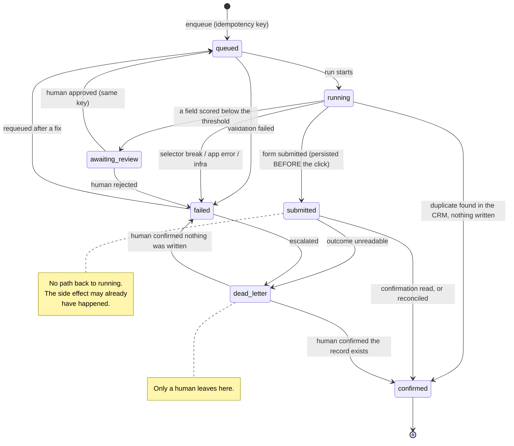

# Prime CRM automation harness

A Playwright harness that logs into Prime CRM the way an external system would —
email, password, and a TOTP code — and creates a lead, treating that creation as
an **irreversible side effect**.

The happy path is the easy part and takes about four seconds. Everything
interesting here is what happens when it does not work: a saved session that has
quietly died, a form that submits but never confirms, input nobody should act on
without a human looking, a CRM that changed its markup last Tuesday.

```
validate → dedupe (local) → session → dedupe (CRM) → write → confirm
└──────────── repeatable ─────────────────────────┘ └─ once ─┘
```

---

## Contents

- [What it does](#what-it-does)
- [Why it is built this way](#why-it-is-built-this-way)
- [Job state machine](#job-state-machine)
- [Setup](#setup)
- [Running it](#running-it)
- [The review queue](#the-review-queue)
- [Evidence and logs](#evidence-and-logs)
- [Tests](#tests)
- [Layout](#layout)
- [Scope and honesty](#scope-and-honesty)

---

## What it does

One job, done carefully:

1. **Validates** the input payload and scores each field's confidence — before
   opening a browser.
2. **Checks for a duplicate** against its own job database, keyed by a hash of
   the payload.
3. **Establishes a session**: loads a saved `storageState`, *verifies* it by
   probing an authenticated element, and falls back to a full login (including
   the TOTP step) only when that probe fails.
4. **Checks the CRM itself** for an existing matching record — the local
   database cannot know about records created by anyone else.
5. **Writes** the lead. Exactly once. Never blind-retried.
6. **Confirms** the write and captures a screenshot as proof.

Anything uncertain stops and asks a person instead of guessing.

---

## Why it is built this way

### Session reuse: verify, never trust

A saved session is a claim about the past. The token may have been revoked, the
password changed, the user deactivated, the tenant suspended — none of which
change the expiry timestamp sitting in the file.

So the harness never reads an expiry. Each run loads the saved state, opens
`/leads`, and looks for `[data-testid="app-sidebar"]`, an element that only
renders inside the authenticated shell. Probe passes → reuse. Probe fails →
throw the state away and log in properly.

The probe costs one page load, roughly 200ms. A job that gets halfway through a
form before discovering the session was dead costs far more, and can leave the
UI in a state nobody wants to reason about.

Sessions are keyed per `(tenant, user)`. That is not cosmetic: this CRM resolves
the tenant from the hostname, so a session for `acme.localhost` is meaningless on
`globex.localhost`. Separate files make cross-tenant reuse structurally
impossible rather than merely discouraged.

**One session per credential set.** A lockfile (`state/<tenant>__<user>.lock`,
created with `wx`, holding a PID and a timestamp) means two jobs cannot log in as
the same user simultaneously. Without it they would race on the same state file —
and worse, TOTP codes are single-use, so one login can consume the time step the
other needs and fail it. Stale locks are reclaimed when the owning process is
gone.

### Idempotency: two checks, because one is not enough

The key is `SHA-256(tenant + canonicalized payload)`. Canonicalisation matters
more than the hash: keys sorted, values trimmed, whitespace collapsed, case
folded, empty values dropped. Without it, a trailing space becomes a second lead.

Two independent checks, in this order:

| Check | Catches | Misses |
|---|---|---|
| Local SQLite, unique index on `(tenant, key)` | Anything this install did before | Records created by a person, another install, or an import |
| Search the CRM before writing | Everything, from any source | Nothing — but costs a page interaction |

The local check is cheap and runs first. The CRM check runs after the session is
up and before the write, because "exactly one write" that only holds for one copy
of the tool is not a guarantee at all.

### The ambiguous write

This is the case the whole design exists for.

The submit button is clicked. Then the browser times out, or the process is
killed, or the confirmation never renders. **Did the record get created?**

The harness does not know, and — this is the important part — it does not guess.

- The job is transitioned to `submitted` **and written to disk before the click
  fires**, with `synchronous = FULL`. A crash a millisecond later still leaves a
  durable marker.
- `submitted` is a terminal state as far as automation is concerned. The state
  machine physically forbids `submitted → running`; there is no code path back
  into the step that writes.
- The next run finds the job in `submitted` and **reconciles**: it searches the
  CRM for the record. Found → `confirmed`, pointing at the record that already
  exists. Not found → `dead_letter`, because "I could not find it" is not proof
  it was never written; the search itself might be lying.
- `dead_letter` means a human looks. It never resolves itself.

A retry here would be the single most damaging thing this program could do. So
the write step is called with `safeToRepeat: false`, and the retry helper takes
that as a required argument rather than an option with a default — the dangerous
case is the one somebody forgets to think about.

### Degrading to a human, not to a retry

Two different kinds of "not sure", handled differently:

- **Malformed** input (`email` is not an email) is a hard failure. No human
  review will fix it, so it fails immediately, before the browser opens.
- **Uncertain** input (`full_name` scored 0.42) is not wrong, it is unverified.
  It goes to `awaiting_review` *before* any write, never after.

Approving from the queue puts the job back on the queue with **the same
idempotency key** and lets the normal runner do the write — so the approved path
goes through exactly the same duplicate checks as the automatic one. Editing a
value changes the key, and the CLI says so out loud, because the reviewer is
choosing to create a distinct record.

### Failure taxonomy

Collapsing these into "it failed" is how automation corrupts data quietly.

| Category | What happened | Retry? | Outcome |
|---|---|---|---|
| `SELECTOR_BREAK` | Page loaded fine; a required `data-testid` is absent. The CRM's markup changed. | Never — it will fail identically forever | `failed` |
| `APP_ERROR` | Page loaded, element found, the application rejected the input. | Never with the same input | `failed` |
| `INFRA` | Timeout, connection reset, browser crash. Nothing is known. | Only for steps declared safe to repeat | `failed` after backoff |
| `AMBIGUOUS_WRITE` | Submitted; outcome unreadable. | **Never** | `dead_letter` (human) |
| `VALIDATION` | Payload is malformed. | Never | `failed` |

The selector-break/infra distinction is drawn by asking the page whether it is
healthy (`document.readyState`) at the moment the element lookup fails. Missing
element on a live page means the markup changed; missing element on a dead page
means the environment did.

### Selectors

Every selector in this package is a `data-testid`. Never a CSS class, never text
content. Classes are styling decisions and change without warning; text is
copy and gets rewritten, translated, or A/B tested. The CRM carries the testids
the harness depends on as part of its own source.

---

## Job state machine



The forbidden transitions are enforced in code (`assertTransition`) and asserted
in the unit tests, not just drawn in this diagram.

---

## Setup

### Prerequisites

- Node 20+
- A running Prime CRM: Django API on `:8000` (`docker compose up` in
  `prime-crm-be/`) and the Next.js app on `:3000` (`npm run dev` in
  `prime-crm-fe/`)
- A tenant whose subdomain resolves — `acme.localhost` works out of the box on
  macOS and most Linux setups; otherwise add it to `/etc/hosts`

### 1. Seed a tenant

From `prime-crm-be/`:

```bash
docker exec prime-crm-be-web-1 python manage.py seed_automation_tenant --schema acme
```

This creates the tenant and its schema, an admin user, the default lead stages,
and an enabled TOTP device. It prints the credentials — including the TOTP secret
— once. It is idempotent; `--reset-totp` issues a fresh secret.

TOTP must also be on platform-wide. In `prime-crm-be/.env`:

```
TOTP_ENABLED=True
```

Then restart the API. With this unset or `False`, login behaves exactly as it did
before 2FA existed, and the harness logs in with just a password.

### 2. Configure the harness

```bash
cd automation
cp .env.example .env
```

Paste the values the seed command printed. `.env` is gitignored and holds a
password and a TOTP seed — it must never be committed.

### 3. Install

```bash
npm install
npm run install:browsers
```

---

## Running it

Create an input file:

```json
{
  "payload": {
    "full_name": "Ada Lovelace",
    "email": "ada@example.com",
    "phone": "+92 300 1234567",
    "min_budget": 100000,
    "max_budget": 250000
  },
  "confidence": {
    "full_name": 0.99,
    "email": 0.62
  }
}
```

```bash
npm run run:job -- ./my-lead.json
```

Fields absent from `confidence` are treated as certain. Anything below
`CONFIDENCE_THRESHOLD` (default `0.8`) routes the job to review instead of
writing it.

Exit codes, for CI:

| Code | Meaning |
|---|---|
| `0` | Confirmed, or a duplicate was correctly blocked |
| `1` | Failed, or parked for human review |
| `2` | Bad usage or a malformed input file |

Other commands:

```bash
npm run jobs                 # list all jobs
npm run jobs awaiting_review # filter by state
npm run review               # work the human queue
```

---

## The review queue

```
$ npm run review

────────────────────────────────────────────────────────────────────────
Job          9c1e...  Tenant  acme     State  awaiting_review
Evidence     artifacts/<runId>/<jobId>/

Extracted values
  full_name      Ada Lovelace                 0.42  ⚠ low
  email          ad********om                 0.95
  phone          +9********67                 0.99
────────────────────────────────────────────────────────────────────────

[a]pprove  [e]dit and approve  [r]eject  [s]kip  [q]uit:
```

A CLI rather than a screen inside the CRM, deliberately: job state lives in this
package's SQLite database, and a review page in the CRM would mean the CRM
reading the harness's internals — exactly the coupling that the browser-only
boundary exists to prevent. The harness talks to the CRM through the browser and
in no other way.

Contact details are masked in the queue. A reviewer checking whether an
extraction is plausible does not need the full value on screen.

---

## Evidence and logs

Per run, under `artifacts/<runId>/<jobId>/`:

| File | Why |
|---|---|
| `*.png` | What an operator would have seen |
| `*.html` | What the selectors were actually looking at (redacted) |
| `*.json` | URL, step, category, timestamp |
| `trace.zip` | Replayable Playwright trace |
| `metrics.json` (run root) | Success rate, failures by category, per-step durations |

Success is captured too, not just failure: the confirmation screenshot is the
proof that an irreversible write happened, and it is what a human compares
against when reconciling later.

### Redaction

**Log identifiers, not payloads.** Job ids, idempotency keys and field *names*
are safe. Passwords, TOTP seeds, session tokens and customers' contact details
are not.

Two layers, because either alone fails:

1. **By key** — anything under `password`, `*secret`, `*token`, `email`, `phone`,
   `full_name`, `notes`, … is replaced regardless of content. Catches secrets in
   shapes nobody anticipated.
2. **By value** — the actual password and TOTP seed are registered at startup and
   scrubbed from every string, so a secret that leaks into an exception message
   or a page snapshot still does not reach disk.

Instead of values, payloads are logged as a shape: `{"full_name":"present(12)",
"notes":"empty"}`. A test asserts that no artifact file contains the password or
the seed.

The key pattern is anchored to whole key names on purpose. A loose substring
match looks safer but swallows `sessionReused` and `accessCount` — redacting your
own metrics is how observability quietly dies.

### Log lines

```json
{"level":"info","time":"2026-08-12T06:20:47Z","runId":"345a...","jobId":"8ed4...",
 "step":"idempotency.remote","resultRef":"a91c...",
 "msg":"Duplicate blocked: the CRM already holds a matching record"}
```

Every line carries `runId`; everything inside a job carries `jobId`. One run is
reconstructable with `grep runId`.

---

## Tests

```bash
npm run verify   # typecheck + unit tests + end-to-end suite
```

Requires the CRM running and `.env` populated. 35 unit tests, 19 end-to-end.

| Spec | Covers |
|---|---|
| `session.spec.ts` | Fresh login through TOTP; reuse on the second run; a session that fails the probe forcing re-login; one lock per credential set |
| `idempotency.spec.ts` | Same input twice → one write; a fresh database still blocked by the CRM check; crash mid-write reconciles instead of rewriting; unreconcilable submission → `dead_letter`; key canonicalisation and tenant scoping |
| `review.spec.ts` | Low confidence routed to review with no write; approval completing the write under the same key; rejection; malformed input failing outright |
| `failure.spec.ts` | Deliberate selector break → `SELECTOR_BREAK`, artifacts captured, no partial write; a guard test proving the CRM still lacks that testid; app rejection → `APP_ERROR`; no secrets in artifacts; non-zero exit |
| `unit/` | State machine transitions (including the forbidden ones), idempotency key canonicalisation, error classification, backoff, redaction, TOTP generation |

The suite runs with one worker and **no retries**. A retry would paper over
exactly the non-idempotency this package exists to prevent.

The selector-break test has a companion guard test that asserts the CRM really
does still expose `lead-full-name` and really does not expose the fake testid.
Without it, a rename in the CRM would turn the selector-break test into a test of
nothing.

TOTP skew, replay rejection and backup-code single use are tested where the
decisions are made — server-side, in
`prime-crm-be/authentication/tests.py` (35 tests, `manage.py test authentication`).
The unit tests here cover the client half: generating a code the server accepts,
and understanding the step boundary.

---

## Layout

```
src/
  config/      Environment loading, credential keys
  session/     Login, storageState, the credential lock
  pages/       Page objects — data-testid selectors only
  jobs/        State machine, SQLite store, idempotency, retry, runner
  validate/    Zod schema, per-field confidence gating
  review/      Human queue CLI
  evidence/    Screenshots, traces, redaction, structured logs, metrics
tests/
  unit/        Pure logic, no browser
  *.spec.ts    End-to-end against a running CRM
state/         Sessions, locks, jobs.sqlite   (gitignored)
artifacts/     Evidence per run               (gitignored)
```

The package talks to the CRM **only through the browser**. It has no import of
CRM source, no database credentials, and no HTTP client pointed at the API. That
constraint is the point: it is what makes this a demonstration of driving a
system you do not control from the inside.

---

## Scope and honesty

**This runs against a CRM I control.** That shapes what it does and does not
demonstrate.

What it does demonstrate: session persistence and verification, per-credential
concurrency control, idempotency across process death, an explicit state machine
with a real dead-letter path, evidence capture, redaction, a failure taxonomy
that drives different behaviour per category, and degrading to a human rather
than retrying an ambiguous write.

What it does not: because I own the target, I added stable `data-testid`
attributes to it. Real third-party automation does not get that luxury and spends
much of its effort on brittle selectors and their maintenance. There is no
CAPTCHA solving, no fingerprint evasion, no proxy rotation, no bot-detection
defeat — not because they are hard, but because doing them against a system you
have not been invited into is a different activity with different ethics. The
interesting engineering here is the failure handling, and that part transfers.

Other limits worth stating plainly:

- The CRM duplicate check matches on `full_name` via the leads search. In
  production this should be a stricter composite (email or phone), and the search
  should be an exact-match endpoint rather than a debounced UI filter.
- Confidence scores arrive with the input. A real pipeline would get them from
  whatever produced the data — OCR, an extraction model, a fuzzy match — and the
  harness's job is to act on them correctly, not to invent them.
- One job per invocation. Batching would need the credential lock to be held
  across jobs rather than acquired per run.
- The reconciliation search can return a false negative if the CRM is slow to
  index. That resolves to `dead_letter`, which is the safe direction: a human is
  asked, and nothing is written twice.
